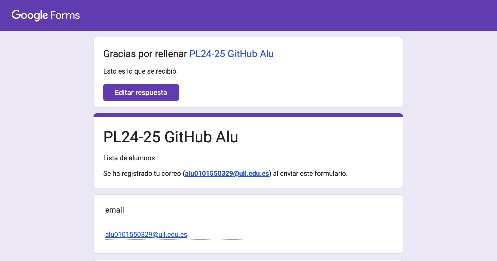
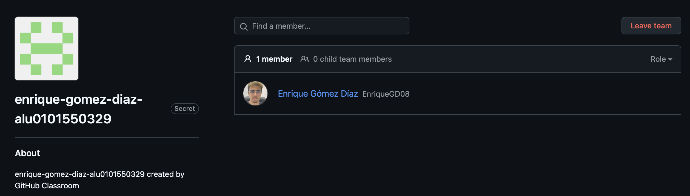
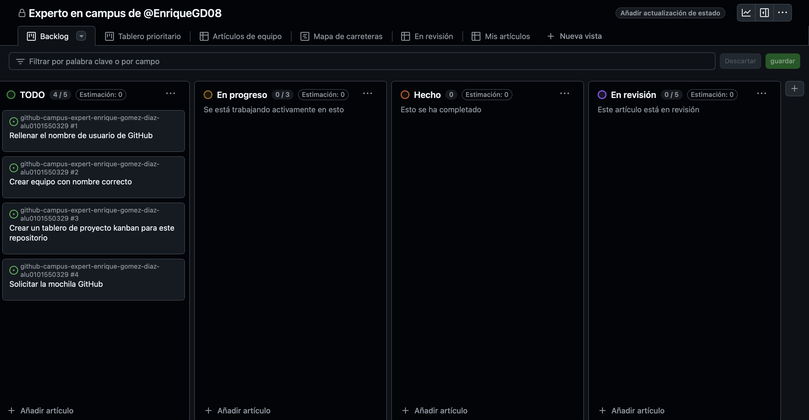
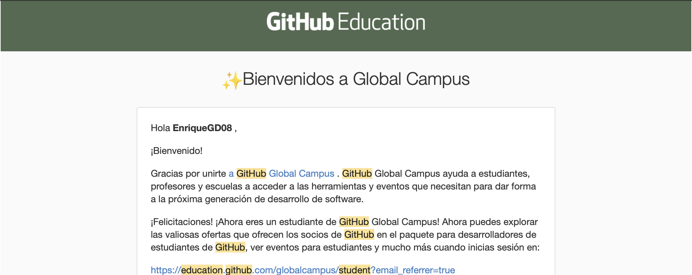

# Github Campus Expert 

- Enrique 
- Gómez Díaz
- alu0101550329

## Rellenar el cuestionario GitHub-Alu del campus virtual y recibir el correo confirmándolo

## Crear equipo con nombre correcto

## Crear un project board kanban para este repositorio

## Solicitar el GitHub Backpack

